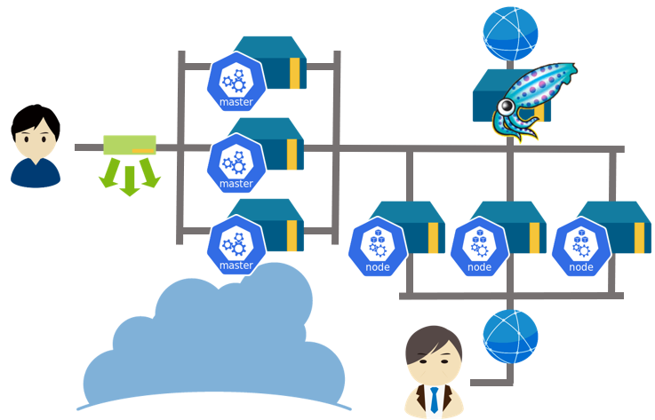

## 🚀Getting Started🚀

[NIFCLOUD](https://pfs.nifcloud.com/)上に[Terraform](https://www.terraform.io/) + [kubespray](https://kubespray.io/#/)でKubernetes Clsuterを構築するやつ

### 概要図



### 準備

- NIFCLOUDのアカウントを用意する
  - ちなみに、無料トライアルがある[FJcloud-V（ニフクラOEM）](https://personal.clouddirect.jp.fujitsu.com/)でも同じことができるはず
  - ~~やったことないので出来ないかも~~
- `ACCESS_KEY_ID`/`SECRET_ACCESS_KEY`を設定
  ```bash
  export NIFCLOUD_ACCESS_KEY_ID=<YOUR ACCESS KEY>
  export NIFCLOUD_SECRET_ACCESS_KEY=<YOUR SECRET ACCESS KEY>
  ```
- Kubernets Clsuterを構築するRegion/Zoneを設定(変更してもよい)
  ```bash
  export TF_VAR_region=jp-west-1
  export TF_VAR_availability_zone=west-11 
  ```

### Create k8s infrastructure

- SSH Keyの生成とアップロード
  ```bash
  terraform -chdir=terraform/live/sshkey-uploder init
  terraform -chdir=terraform/live/sshkey-uploder apply
  ```
- Elastic IPの作成
  ```bash
  terraform -chdir=terraform/live/elasticip/ init
  terraform -chdir=terraform/live/elasticip/ apply
  ```
- Kubernetesのインフラストラクチャの作成
  ```bash
  export TF_VAR_working_server_ip=$(curl ifconfig.me)
  terraform -chdir=terraform/live/cluster/ init
  terraform -chdir=terraform/live/cluster/ apply
  ```

### Build k8s Cluster

#### 準備

- 環境変数の設定
  ```bash
  KUBESPRAY_VERSION=v2.21.0
  export BASTION_IP=$(terraform -chdir=terraform/live/elasticip/ output -json | jq -r .bastion.value)
  export ANSIBLE_SSH_ARGS="-o StrictHostKeyChecking=no -o UserKnownHostsFile=/dev/null -o ProxyCommand=\"ssh root@${BASTION_IP} -W %h:%p\""
  export CP_LB_IP=$(terraform -chdir=terraform/live/cluster/ output -json | jq -r .control_plane_lb.value)
  ```
- 構築したインフラの情報をファイルに保存
  - wk/cpの数変えてたらansible/mycluster/hosts.yamlの編集も必要
  ```bash
  EXTRA_VARS_FILE=ansible/extra-vars_cluster_info.yml
  echo "---" > ${EXTRA_VARS_FILE}
  terraform -chdir=terraform/live/cluster/ output -json | jq -r -c '.bastion_info.value | to_entries[] | .result = .key + ": " + .value.private_ip | .result' >> ${EXTRA_VARS_FILE}
  terraform -chdir=terraform/live/cluster/ output -json | jq -r -c '.egress_info.value | to_entries[] | .result = .key + ": " + .value.private_ip | .result' >> ${EXTRA_VARS_FILE}
  terraform -chdir=terraform/live/cluster/ output -json | jq -r -c '.worker_info.value | to_entries[] | .result = .key + ": " + .value.private_ip | .result' >> ${EXTRA_VARS_FILE}
  terraform -chdir=terraform/live/cluster/ output -json | jq -r -c '.control_plane_info.value | to_entries[] | .result = .key + ": " + .value.private_ip | .result' >> ${EXTRA_VARS_FILE}
  ```
- 実行環境のbash取得
  ```bash
  docker run --rm -it -e CP_LB_IP -e ANSIBLE_SSH_ARGS -e BASTION_IP --mount type=bind,source="$(pwd)",dst=/wd  quay.io/kubespray/kubespray:${KUBESPRAY_VERSION} bash
  ```
- 必要なパッケージの取得
  ```bash
  # https://github.com/kubernetes-sigs/kubespray/issues/9695
  pip install jmespath==0.9.5
  ansible-galaxy install -r /wd/ansible/requirements.yml 
  ```
- ssh keyの設定
  ```bash
  eval `ssh-agent`
  ssh-add /wd/out/key
  ```

#### Egressの構築

- `setup_egress.yml`を実行
  ```bash
  ansible-playbook -i /wd/ansible/mycluster/hosts.yaml -e @/wd/ansible/extra-vars_cluster_info.yml /wd/ansible/setup_egress.yml 
  ```

#### Kubernets clusterの構築

- `cluster.yml`を実行
  ```bash
  ansible-playbook -i /wd/ansible/mycluster/hosts.yaml -e cp_lb_ip=${CP_LB_IP} -e @/wd/ansible/extra-vars_cluster_info.yml  cluster.yml
  ```
  - だいたい１時間くらいかかる...

#### Bastionの構築

- `setup_bastion.yml`を実行
  ```bash
  cp /wd/ansible/setup_bastion.yml .
  ansible-playbook -i /wd/ansible/mycluster/hosts.yaml -e cp_lb_ip=${CP_LB_IP} -e @/wd/ansible/extra-vars_cluster_info.yml setup_bastion.yml 
  ```

### 接続確認

- BastionにSSH接続
  ```bash
  ssh -i out/key root@${BASTION_IP}
  ```
- kubectl実行
  ```
  kubectl get pod -A
  ```

## さいごに

- out/keyを誰にも内緒の秘密の場所に保存する🤫


